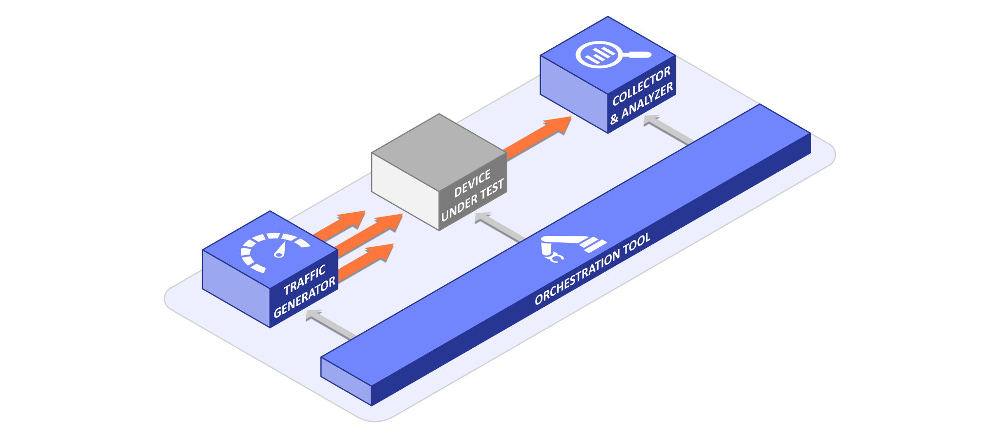

# FlowTest

FlowTest is a complex testbed for testing NetFlow/IPFIX monitoring probes. It includes
a traffic generator and player that is capable of simulating traffic of realistic 1/10/100 Gbps
networks, a library with various evaluation models to compare the output of the probe under
test with expected flow records, and an orchestration tool that provides test automation
and controls the entire environment.



Key features:
- Tools for extracting network traffic profiles of real (high-speed) networks.
- Generator of realistic network traffic (in the form of a PCAP file) based on network traffic profiles.
- High-speed PCAP player with a support for various outputs and replay speeds of 1/10/100 Gbps and more.
- Python library for comparing network flows (i.e. expected vs. received IPFIX/NetFlow records).
- Orchestration tool for automated execution of various testing scenarios and handling network devices which participate in the test.
- Tests verifying the output correctness and performance of the monitoring probes in real operation.
- Automatic and easy test environment setup using Ansible playbooks.
- Dataset of manually annotated PCAPs of various network protocols with network flow descriptions.
- Dataset of 1/10/100 Gbps network profiles from which realistic traffic can be generated.

❤️ *If you use the tools or datasets resulting from this project, be sure to let us know. These
references help us to get support for further development and new amazing projects. Use, for example,
FlowTest project [discussion forum](https://github.com/CESNET/FlowTest/discussions).*

The project, datasets and tools were developed in cooperation between
[CESNET](https://cesnet.cz) and [Progress Flowmon](https://flowmon.com) with a grant
from the [Ministry of the Interior of the Czech Republic](https://www.mvcr.cz/)
(see Acknowledgement section).

## Tools

The project provides a set of various tools. They can typically be used individually (e.g., to
generate realistic network traffic) or as a whole to create a testbed for testing network monitoring
probes. The steps to build or install them are shown in the [section](#setup-and-installation) below.

- [`ft-profiler`](tools/ft-profiler/) (Python) - Create network profiles from existing
  NetFlow/IPFIX records.
- [`ft-profile-sampler`](tools/ft-profile-sampler/) (C++) - Reduce size of high-speed network
  profiles without skewing profile characteristics.
- [`ft-profile-trimmer`](tools/ft-profile-trimmer/) (Python) - Trim network profiles of excessive
  records.
- [`ft-generator`](tools/ft-generator/) (C++) - Generate complex network traffic based on network
  profiles.
- [`ft-replay`](tools/ft-replay/) (C++) - Replay PCAPs at very high speed via various outputs
  (AF_PACKET, AF_XDP, etc.)
- [`ft-analyzer`](tools/ft-analyzer/) (Python) - A library for comparing flow records.
- [`ft-orchestration`](tools/ft-orchestration/) (Python) - Orchestration tool for automated test
  execution.

## Testbed

A malfunctioning NetFlow/IPFIX probe can, for example, generate partial or even incorrect flow
records that can be misleading when analyzing security events. As a result, such probes can also
cause false reports or, even worse, mask critical security threats.

- Do you know if your NetFlow/IPFIX probe is correctly extracting important information from
  network traffic?
- Are you sure that the probe does not generate unexpected flow records?
- What are its performance limits and when does it start to drop traffic and create incomplete
  records?

By using tools in this project, it is possible to create a comprehensive test environment
for testing NetFlow/IPFIX probes in various realistic environments. This makes it easy to
verify that the probe you are using to monitor your network correctly reports network status
and handles your network traffic. In addition, automated tests can be used to repeatedly verify
functionality across different probe configurations or after software updates.

💡 If you want to test your probe or want to replicate our test environment in your lab, contact
us and let's discuss the possibilities of cooperation.

## Setup and installation

At the moment, RHEL 8/9 and derived distributions (e.g. Oracle Linux or Rocky Linux) are
supported. On other distributions, compiling and running tools should be also possible, but
installation of dependencies may vary.

You can prepare a complete development environment including all dependencies or, for example,
just an environment for running Python tools. In the case of automated environment
preparation, we use Ansible playbooks that are prepared **only** for RHEL 8/9 and its derived
distributions (e.g. Oracle Linux or Rocky Linux).

See the following options:

<details>
  <summary>🔧 <b>Automated preparation of the complete development environment.</b></summary>

  ``` bash
  # Install all C++ dependencies and prepare Python environment.
  # Default Ansible playbook "dev_machine.yaml" will run on your machine.
  # If the prompt "BECOME password:" appears, enter the root password.
  sudo dnf -y install epel-release
  sudo dnf -y install ansible
  ./prepare_machine.sh

  # If you want to build and optionally install C++ tools (e.g. ft-generator
  # or ft-replay), run following commands:
  mkdir build && cd build
  cmake -DCMAKE_INSTALL_PREFIX=/usr ..
  make -j8
  sudo make install

  # If you want to run Python tools, active Python environment (pipenv) and
  # follow the instructions in the README of the individual tools.
  # Note: If you compiled C++ tools in the previous step, you must return to
  # the root of the project directory first.
  . venv/bin/activate
```

Note: For RHEL 8 (and derived distributions), the system Python will be upgraded to version
3.9, as older versions are no longer supported.

</details>

<details>
  <summary>🔧 <b>Automated preparation of the environment for running Python tools only.</b></summary>

  ``` bash
  # Prepare Python environment using Ansible playbook "python_machine.yaml".
  # If the prompt "BECOME password:" appears, enter the root password.
  sudo dnf -y install epel-release
  sudo dnf -y install ansible
  ./prepare_machine.sh -p ansible/python_machine.yaml

  # Active Python environment (pipenv) and follow the instructions
  # in the README of the individual tools.
  . venv/bin/activate
  ```

  Note: For RHEL 8 (and derived distributions), the system Python will be upgraded to version
  3.9, as older versions are no longer supported.
</details>

<details>
  <summary>🔧 <b>Manual preparation of the environment for running Python tools.</b></summary>

  If you previously performed the automated installation using the above procedure, you
  do not  need to repeat these steps. These instructions are just in case you can't use
  Ansible for some reason.

  Running the tools requires at least Python 3.9 (see the output of `python --version`).
  If an older version is installed on your system, please upgrade first. In addition to Python
  itself, you need to have `pip` and `setuptools` installed. For example, on RHEL 9+ (and
  derived distributions) you only need to run:

  ``` bash
  sudo dnf -y install python3 python3-setuptools python3-pip
  ```

  Next, you need to prepare the Python environment with the dependencies installed:
  ``` bash
  # Prepare Python virtual environment
  pip3 install --upgrade pip
  python3 -m venv --prompt flowtest venv

  # Activate it
  . venv/bin/activate

  # Install dependencies
  python3 -m pip install pipenv
  pipenv install --dev
  ```

  With active virtual environment, you can now run Python tools.
</details>

<details>
  <summary>🔧 <b>Manual installation of dependencies and build of C++ tools (RHEL & Rocky/Oracle Linux).</b></summary>

  If you previously performed the automated installation using the above procedure, you
  do not  need to repeat these steps. These instructions are just in case you can't use
  Ansible for some reason.

  ``` bash
  # Enable EPEL RPM repository
  sudo dnf -y install epel-release

  # Enable system "CodeReady Linux Builder (CRB)" RPM repository.
  # Depending on your system, the repository name, i.e. "crb", may vary.
  # For example:
  # - on RHEL 8 distributions (excluding Oracle Linux) use: "powertools"
  # - on Oracle Linux 8 use: "ol8_codeready_builder"
  # - on Oracle Linux 9 use: "ol9_codeready_builder"
  sudo dnf -y install "dnf-command(config-manager)"
  sudo dnf config-manager --set-enabled crb

  # Install libraries and build tools
  sudo dnf -y install git cmake make rpm-build gcc gcc-c++
  sudo dnf -y install libpcap-devel xxhash-libs xxhash-devel glpk-devel
  sudo dnf -y install kernel-header libbpf-devel openssl-devel
  # On RHEL 9+ (and derived distributions) install additional library
  sudo dnf -y install libxdp-devel

  # Build and optionally install C++ tools (e.g. ft-generator or ft-replay):
  mkdir build && cd build
  cmake -DCMAKE_INSTALL_PREFIX=/usr ..
  make -j8
  sudo make install
```
</details>

<details>
  <summary>🔧 <b>Manual installation of dependencies and build of C++ tools (Debian & Ubuntu)</b></summary>

  This manual may not be complete and may vary slightly depending on the
  distribution and its version. Suggestions for improvements are welcome.

  Note: The "sudo" tool must be installed and the user must have administrative rights.

  ``` bash
  # Install libraries and build tools
  sudo apt-get install -y git cmake gcc g++ pkg-config
  sudo apt-get install -y libpcap-dev libxxhash-dev libglpk-dev libbpf-dev libssl-dev
  # On Debian 12+ and Ubuntu 22.04+ install additional library
  sudo apt-get install -y libxdp-dev

  # Build and optionally install C++ tools (e.g. ft-generator or ft-replay):
  mkdir build && cd build
  cmake -DCMAKE_INSTALL_PREFIX=/usr -DENABLE_RPMBUILD=Off ..
  make -j8
  sudo make install
```
</details>

## Datasets

### PCAPs with annotation of flow records

As part of the project, a set of PCAPs was created with annotations of the individual flows
they contain. Individual PCAP files typically contain only several packets to verify the
capability of the probe to extract specific information from provided packets. Included within
the dataset are essential protocols such as VLAN, MPLS, IPv4, IPv6, ICMP, ICMPv6, TCP or UDP as
well as packets containing application data such as DNS, TLS or HTTP. Samples can be found in
the [/pcap](pcap/) directory.

Annotations contain data which are expected to be present in the output of the tested
monitoring probe. When using L7 protocols in particular, it is necessary to consider whether
the probe can perform deep packet inspection of the specific protocol.
Annotations can be found in the [/testing/validation](testing/validation/) directory.

PCAPs and annotations are used by the orchestration tool, `ft-orchestration`, as part of so-called
validation tests.

### Network profiles

A network profile is an anonymous list of flow records that can be used to reproduce network
traffic with similar characteristics as the original traffic. The profile can be given to
a packet generator (`ft-generator`), which creates a PCAP file with network packets
based on the provided profile. The advantage of network profiles is that due to their anonymity
they can be publicly shared, modified as needed and the resulting PCAP files are
annotated at the level of individual flow records.

The profile structure itself is simple and intuitive. Each profile is stored as a CSV file
where each record (i.e. row) represents a single bidirectional flow (i.e. typically client
and server communication) with information about the start and end time, L3 and L4 protocol,
the source and destination ports, and the number of transmitted bytes and packets in
both directions of communication. There are no IP addresses or other sensitive data.

The dataset with network profiles for 1/10/100 Gbps networks in various situations can be found
at the link below. Typical network utilization is between 10-30%, so don't expect profiles
with full link saturation. Nevertheless, `ft-replay` tool can be used to achieve full link
saturation later during the playback.
```
https://www.liberouter.org/repo/flowtest/profiles/
```

The profiles were usually created according to the following procedure:

1. The procedure starts with the creation of so-called "origin" profiles, which are
   created using flow records from existing NetFlow/IPFIX collectors. Using the `ft-profiler`
   tool, all records from a typically 20-minute interval were read, paired and stored in
   an anonymized CSV file.

   However, since flow records are typically stored unordered on the NetFlow/IPFIX collector
   and potentially arrive late due to the active timeouts of the probes themselves (we consider
   a typical 300 second timeout), the first and last 5 minutes of the "original" profile should
   be considered incomplete because it may be missing some records.

2. In order to create a reasonably sized PCAP (~20-50 GB) with several minutes of network traffic,
   it is usually necessary to sample high-speed network profiles using `ft-profile-sampler` tool.
   For example, for 10 Gbps networks it is usually sufficient to use sampling 1:2 - 1:5. This
   sampling can later be reversed when the PCAP is replayed by `ft-replay` tool using the
   traffic replication feature.

3. The last step is to remove - as described above - the incomplete edges of the "origin" profile.
   Tool `ft-profile-trimmer` is designed for this purpose, as it extracts an interval of interest
   of the desired length from any profile. Moreover, it supports so-called tolerance intervals to
   ensure a gradual ramp-up and gradual ramp-down of traffic, so that the device under test does
   not get shocked with a sudden jump in the number of unique flows.

   Our goal was to simulate a network communication of 360 seconds with 10 second tolerance
   intervals. Thus, the profiles trimmed in this way are also part of the dataset.

The dataset usually contains profiles at all the processing stages and, where appropriate,
in variants with different levels of sampling. You can also further customize the profiles
according to your needs. The directory structure of the profiles is as follows:

```
100G_CesnetNixZikova_WorkdayMorning
├── profile_origin.csv                   # Origin profile from ft-profiler
├── profile_origin.txt                   # Parameters of the origin profile
├── profile_sampled_1-20.csv             # Sampled profile 1:20
├── profile_trimmed_1-20_360s_10s.csv    # Final sampled and trimmed profile
├── profile_trimmed_1-20_360s_10s.png    # Final profile visualization
└── profile_trimmed_1-20_360s_10s.txt    # Final profile parameters
```

For generating PCAPs using the `ft-generator` tool, we recommend using **only** trimmed profiles.
These network profiles are used by the orchestration tool, `ft-orchestration`, as part of so-called
simulation and performance tests.

## Acknowledgement

The software was developed within the scope of the Security Research Programme
of the Czech Republic SECTECH 2021-2026 granted by the Ministry of the Interior of the
Czech Republic under the project No. VB01000032 - FlowTest: testing of network monitoring
devices.
