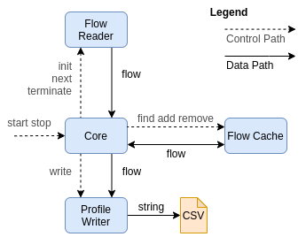

# Flowtest Profiler

Flowtest profiler (further only *profiler*) is a tool for creating **network profiles** from a certain time period using netflow data.
Network profile is **anonymous list of flow records** which can be used to replicate network traffic with similar
characteristics as the original traffic which those flow records are based upon.

Network profile is created from flow records originating from a network traffic on a **single network interface**.
Network profile **does not** contain ARP traffic.

## Table of Contents

* [Build and Installation](#build-and-installation)
* [Architecture](#architecture)
* [Output Format](#output-format)
* [Usage](#usage)
* [Flow Readers](#flow-readers)
    * [Nffile Reader](#nffile-reader)
    * [Fdsfile Reader](#fdsfile-reader)
    * [CSVFile Reader](#csvfile-reader)
* [Profile Sampler](#profile-sampler)
    * [Dependencies](#dependencies)
    * [How It Works](#how-it-works)
    * [Usage](#usage-1)

## Build and Installation

Run `python3 -m build` to build the **ftprofiler** package. The resulting source files (.tar.gz) and wheel (.whl) file
can be found in `dist/` directory.

Preferred installation is done using command `python3 -m pip install <path to the wheel file>`.

## Architecture



Profiler consists of the following components:
* *Core* - initializes and terminates other components, handles exceptions, processes configuration,
           passes flow records from reader to the flow cache and from the flow cache to the writer.
* *Flow Reader* - continuously reads flow records from the system, converts them into internal representation
                  and pass them to the core.
* *Flow Cache* - hash map of flow records useful for temporarily storing incoming flow records to merge
                 unidirectional flows into bidirectional flows and to merge together flows split due to active timeout.
                 Has a defined maximum size to prevent consuming too many of system resources.
* *Profile Writer* - stores biflow records in CSV format into a file.
                     Optionally, the flow records can be compressed using gzip.

## Output Format

Output of the profiler is a CSV file containing anonymized biflow records with following fields:
 * *START_TIME* - relative time of the first observed packet of the flow (in milliseconds) offset from time zero
 * *END_TIME* - relative time of the last observed packet of the flow (in milliseconds) offset from time zero
 * *L3_PROTO* - either 4 for IPv4 or 6 for IPv6
 * *L4_PROTO* - protocol number assigned by *[IANA](https://www.iana.org/assignments/protocol-numbers/protocol-numbers.xhtml)*
 * *SRC_PORT* - source port number (0 in case the L4 protocol is not TCP or UDP)
 * *DST_PORT* - destination port number (0 in case the L4 protocol is not TCP or UDP)
 * *PACKETS* - number of packets observed in a single direction of the flow
 * *BYTES* - number of bytes observed in a single direction of the flow
 * *PACKETS_REV* - number of packets observed in the opposite direction of the flow (0 if the other direction was not found)
 * *BYTES_REV* - number of bytes observed in the opposite direction of the flow (0 if the other direction was not found)

## Usage

Start the profiler by running `ftprofiler <args>`.

Arguments:
```
positional arguments:
  {nffile,fdsfile}      Flow Readers

arguments:
  -h, --help            show this help message and exit
  -V, --version         show program's version number and exit
  -o OUTPUT, --output OUTPUT
                        path to an output file where the profile is to be written
  -g, --gzip            compress output using gzip algorithm
  -a ACTIVE, --active ACTIVE
                        value of the active timeout in seconds (default: 300s)
  -i INACTIVE, --inactive INACTIVE
                        value of the inactive timeout in seconds (default: 30s)
  -m MEMORY, --memory MEMORY
                        limit the maximum number of MiB consumed by the flow cache (default: 2048 MiB)
```

## Flow Readers

Flow readers are capable to acquire flow records from the system by different means.
**Only one** flow reader can be specified when starting the Profiler.

All flow readers must implement interface defined [here](src/ftprofiler/readers/interface.py).

### Nffile Reader

Nffile reader internally starts **nfdump** process which reads files in **nffile** format, which are passed as argument.
The Nffile reader filters out ARP traffic and selects traffic from a single network interface bz SNMP ID
(consists of router IP and interface ID).

Arguments:
```
arguments:
  -h, --help            show this help message and exit
  -c COUNT, --count COUNT
                        limit the number of records read by nfdump (default: 0 - unlimited)
  -i IFCID, --ifcid IFCID
                        interface ID of exporter process (default: 0)
  -M MULTIDIR, --multidir MULTIDIR
                        Specify directories where nffile should be searched for.
                        The actual files are provided in R argument. Nfdump -M argument (man nfdump).
  -r ROUTER, --router ROUTER
                        IP address where exporter process creates flow (default: 127.0.0.1)
  -R READ, --read READ  specify files to be read by nfdump. Nfdump -R argument (man nfdump)
```

### Fdsfile Reader

Fdsfile reader internally starts **fdsdump** process which reads files in **fds** format, which are passed as argument.

Arguments:
```
arguments:
  -h, --help            show this help message and exit
  -c COUNT, --count COUNT
                        limit the number of records read by fdsdump (default: 0 - unlimited)
  -F FILTER, --filter FILTER
                        filter records, specified in bpf-like syntax (see fdsdump -F switch documentation)
  -R READ, --read READ  specify files to be read by fdsdump. Supports glob patterns.
```

### CSVFile Reader

CSVFile reader processes a file in CSV format with the following fields:

```
START_TIME (float unix timestamp in seconds, e.g., 1438603883.553), DURATION (float in seconds, e.g., 10.5),
PROTO (L4), SRC_IP, DST_IP, SRC_PORT, DST_PORT, PACKETS, BYTES
```

Lines starting with char # are skipped. Fields in the header do not need to be in this exact order.
First row must contain the header.

This reader is mainly used for debugging and testing purposes.

Arguments:
```
arguments:
  -h, --help           show this help message and exit
  -f FILE, --file FILE path to a CSV file which should be processed
```

## Profile Sampler

Due to the size of profiles created in the 100Gb environments, it is necessary to perform some sort of sampling.
However, sampling biflows in the profile randomly is likely to change some important traffic characteristics.
Namely:
* packets to bytes ratio
* biflows to packets ratio
* biflows to bytes ratio
* IPv6 to IPv4 ratio
* proportional representation of L4 protocols in the profile (top 5)
* proportional representation of source and destination ports in the profile (top 10)
* proportional representation of average packet sizes in biflows

The profile sampling is implemented using a genetic algorithm to find a sample
(further referred to as *solution*) of the profile in which none of the specified characteristics
(further referred to as *metrics*) deviate more than a certain percentage from the original profile.

### Dependencies

Profile sampler utilizes the following 3rd-party libraries:
* [NumPy](https://numpy.org/) for fast computation
* [pandas](https://pandas.pydata.org/) for big data operations and manipulations with the profile
* [PyGAD](https://pygad.readthedocs.io/en/latest/) for building the genetic algorithm

### How It Works

Each individual in the population is encoded as a bitmap where each index indicates
whether the biflow in the profile with such index is present in the solution or not.

At the beginning of the genetic algorithm, several individuals are initialized randomly.
This is done by putting random number of ones (with respect to the provided lower and upper bounds)
into the bitmap of each individual.

**Fitness** value of an individual is set to **100 minus percentual deviation of every metric from the original metrics**.
Solutions which have superb results in some metrics and terrible in other metrics are considered worse
than solutions where all metric deviations are mediocre.
To further penalize solutions where some metrics deviate more than 1% from the original,
all metric deviations are squared.
Generally, it is expected that deviations start to get below 1% for solutions with fitness above 94.

**Selection** of individuals for the next generation is done using
[stochastic universal sampling](https://en.wikipedia.org/wiki/Stochastic_universal_sampling)
which increases the chance for individuals with worse fitness value to survive the selection process.
This reduces evolution pressure and decreases the chance of the algorithm to get stuck in a local optimum.

**Crossover** is done from 4 individuals using standard
[two-points strategy](https://en.wikipedia.org/wiki/Crossover_(genetic_algorithm)).

**Mutation** operator exhibits the most influence on the outcome of the genetic algorithm.
It shuffles random part of the genome of the solution. Shuffling is perfect in this case as it does
not introduce new biflows into the solution, thus the number of biflows stays within the sampling bounds.
Finding a solution with fitness around 90 is not difficult. Therefore, it is a good idea to mutate larger
portion of the genome for solutions with fitness below 90 and smaller portion for solutions with fitness
above 90 to ensure slow and steady climb towards acceptable solution.

The algorithm runs for a fixed number of generations or until it finds a solution
which satisfies the criteria for acceptance.

### Usage

Start the profile sampler by running `profile_sampler <args>`.

Arguments:
```
  -h, --help            show this help message and exit
  -V, --version         show program's version number and exit
  -a MAX_SAMPLING, --max-sampling MAX_SAMPLING
                        maximum sampling value (must be between 0 and 1, higher than minimum sampling value)
  -i MIN_SAMPLING, --min-sampling MIN_SAMPLING
                        minimum sampling value (must be between 0 and 1, lower than minimum sampling value)
  -d DEVIATION, --deviation DEVIATION
                        acceptable deviation (%) for each solution metric from the original profile metric (default: 1.0)
  -p PROFILE, --profile PROFILE
                        path to the CSV profile file
  -r RESULT, --result RESULT
                        path to a file where the result (profile sample) is to be written
  -m METRICS, --metrics METRICS
                        path to a file where result metrics are to be written
  -e SEED, --seed SEED  seed to be passed to the random number generator (default: None)
  -g GENERATIONS, --generations GENERATIONS
                        number of generations (default: 500)
  -s SIZE, --size SIZE  number of solutions per generation (default: 30)
  -q, --quiet           do not print regular information
```
